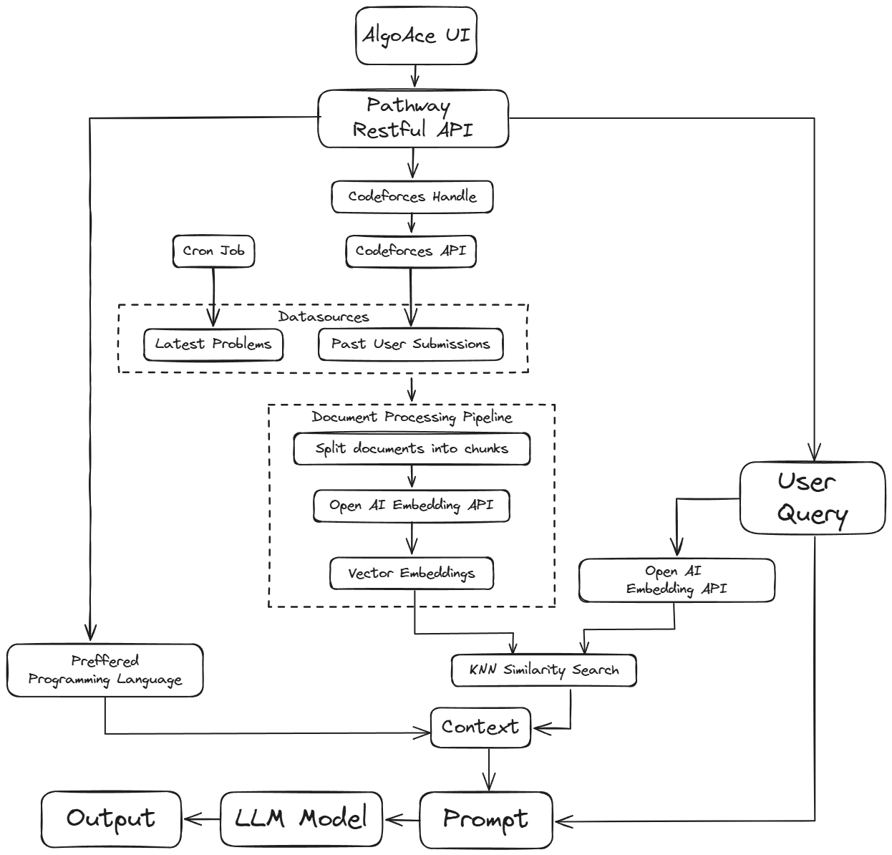

<!-- PROJECT LOGO -->
<br />
<div align="center">
  


  <h3 align="center">AlgoAce - The Competitive Programming Buddy</h3>

  <p align="center">
    An RAG based LLM app to help with your competitive programming queries 
    <br />
    <a href="#demo">View Demo</a>
    ·
    <a href="https://github.com/AnavAgrawal/AlgoAce/issues">Report Bug</a>
  </p>
</div>

<!-- TABLE OF CONTENTS -->
<details>
  <summary>Table of Contents</summary>
  <ol>
    <li>
      <a href="#about-the-project">About The Project</a>
      <ul>
        <li><a href="#demo">Demo</a></li>
        <li><a href="#built-with">Built With</a></li>
      </ul>
    </li>
    <li><a href="#architecture">Architecture</a></li>
    <li>
      <a href="#project-impact-and-key-aspects">Project Impact and Key Aspects</a>
      <ul>
        <li><a href="#end-user-and-impacted-industry">End User and Impacted Industry</a></li>
        <li><a href="#business-impact">Business Impact</a></li>
        <li><a href="#key-features">Key Features</a></li>
        <li><a href="#future-enhancements">Future Enhancements</a></li>
      </ul>
    </li>
    <li>
      <a href="#installation">Installation</a>
      <ul>
        <li><a href="#a-run-with-docker">Using Docker</a></li>
        <li><a href="#b-run-with-conda">Using Conda</a></li>
      </ul>
    </li>
    <li><a href="#usage">Usage</a></li>
    <li><a href="#contributing">Contributing</a></li>
  </ol>
</details>


<!-- ABOUT THE PROJECT -->
## About The Project

AlgoAce is an AI-powered coding assistant built on Pathway's cutting-edge LLMApp architecture, revolutionizing the competitive programming experience by seamlessly integrating with Codeforces, leveraging users' performance data and problem sets to provide personalized guidance through intelligent context understanding, natural language processing, and tailored responses.

### Demo

https://github.com/AnavAgrawal/AlgoAce/assets/70776064/dd0d8f51-3e6d-45fc-87c6-4903e59dccc4

### Built With

This project was built as a sumbission for the final project in Pathway's 3-Week LLM Building Bootcamp. The tools used for building this app are:

* [Pathway's LLM App](https://pathway.com/developers/showcases/llm-app-pathway)

* [Streamlit](https://streamlit.io/)

* [Codeforces API](https://codeforces.com/api/)

## Architecture


### UI and API Layer
- **AlgoAce UI:** The user interface where users interact with the system. Users submit queries through this interface.
- **Pathway Restful API:** Acts as the bridge between the UI and the backend services. It processes incoming requests and interacts with various internal components to fetch and return the necessary information.

### Data Collection and Processing
- **Codeforces Handle and API:** The system uses the user's Codeforces handle to fetch historical data of user submissions via the Codeforces API.
- **Cron Job:** A scheduled task that periodically fetches the latest problems from Codeforces to ensure the system has up-to-date information.
- **Document Processing Pipeline:** Fetched documents are split into smaller chunks for efficient processing. These chunks are then processed through the OpenAI Embedding API to generate vector embeddings, which are numerical representations of the text that capture semantic meaning.

### Query Handling and Response Generation
- **User Query:** When a user submits a query, it is processed to generate a vector embedding using the OpenAI Embedding API.
- **KNN Similarity Search:** A K-Nearest Neighbors (KNN) search is performed using the generated embedding to find the most similar documents from the previously stored vector embeddings.
- **Context and Prompt Generation:** The system builds context for the user's query by integrating relevant information from the similarity search and the user's preferred programming language. A prompt is generated using this context, which is then fed into a Large Language Model (LLM) to produce a coherent and relevant response.
- **Output:** The final response, generated by the LLM, is tailored to the user's query and programming preferences and is sent back to the user through the AlgoAce UI.


## Project Impact and Key Aspects

### End-user and Impacted Industry
**End-User:** Competitive programmers, coding enthusiasts, and students seeking to enhance their problem-solving and coding skills.

**Impacted Industry:** Education and Skill Development.

### Business Impact
AlgoAce is a valuable tool for the competitive programming community, offering personalized coding assistance and insights:

- **Educational Impact:** AlgoAce democratizes access to personalized coding education, empowering learners to improve their problem-solving abilities and coding proficiency effectively.
- **Competitive Advantage:** By leveraging a user's Codeforces performance data and recent problem sets, AlgoAce provides tailored guidance, helping participants gain a competitive edge in coding competitions.
- **Skill Development:** With its interactive coding assistance, AlgoAce supports continuous skill development, equipping users with the necessary tools to excel in their coding endeavors, ultimately contributing to a more skilled and innovative workforce.

### Key Features
- **Codeforces Integration:** Users can input their Codeforces handle, allowing AlgoAce to retrieve their past submissions and performance data, tailoring the assistance to their specific strengths and areas for improvement.
- **Personalized Coding Assistance:** AlgoAce leverages the user's Codeforces data and the latest Codeforces problem sets as contextual information to provide personalized guidance, explanations, and code examples, addressing the user's specific coding queries.
- **Interactive Experience:** With its conversational interface, AlgoAce offers an engaging and interactive coding experience, allowing users to ask follow-up questions and receive real-time feedback.

### Future Enhancements
- **Expanded Problem Set Integration:** Incorporate additional competitive programming platforms and problem sets to broaden the scope of contextual information available to AlgoAce.
- **Adaptive Learning:** Implement adaptive learning algorithms to tailor the level of explanations and guidance based on the user's skill level and progression.
- **Performance Analytics:** Provide users with detailed performance analytics, tracking their progress, identifying areas for improvement, and suggesting personalized learning paths.
- **Collaborative Learning:** Introduce collaborative features that enable users to share their coding experiences, discuss solutions, and learn from one another, fostering a vibrant coding community.
<!-- GETTING STARTED -->

## Installation

### A. Run with Docker

### Prerequisites

Ensure you have Docker and docker compose both latest version installed on your system before proceeding. Docker compose  will be used to build and run the application in a containerized environment. For installation please refer the offcial documneation of docker [Docker Installation Guide](https://docs.docker.com/compose/install/linux/)

- **OpenAI API Key**:
    - To access the OpenAI API, you will need to create an API Key. You can do this by logging into the [OpenAI] (https://openai.com/product) website and navigating to the API Key management page.


### 1. Environment Setup

1. Create a `.env` file in the root directory of your project.
2. Add the following lines to the `.env` file, replacing `{YOUR_OPENAI_KEY}` with your actual OpenAI API key:

   ```env
    OPENAI_API_TOKEN={YOUR_OPENAI_KEY}
    HOST=0.0.0.0
    PORT=8080
    EMBEDDER_LOCATOR=text-embedding-ada-002
    EMBEDDING_DIMENSION=1536
    MODEL_LOCATOR=gpt-4o
    MAX_TOKENS=400
    TEMPERATURE=0.2
   ```

This file will be used by Docker to set the environment variables inside the container.

### 2. Build and Run the Docker Image

With the environment variables set up, you can now build the Docker and run the image for the project.

- Open a terminal or command prompt.
- Navigate to the root directory of your project.
- Execute the following command to build and run the docker:

  ```sh
  docker compose up
  ```

This step compiles your application and its dependencies into a Docker image.


### 3. Access the Application

- Open your web browser.
- Navigate to `localhost:8501` to access the application.

You should see the application's interface if the setup was successful. This confirms that your Docker container is running and the application is accessible.

### 4. Troubleshooting

If you encounter any issues during the setup or execution process, please check the following:

- Ensure Docker is running on your system.
- Verify that the `.env` file contains the correct API key and settings.
- Make sure the Docker image was built successfully without errors.
- Check if the Docker container is running and the ports are correctly mapped.

For further assistance, consult the Docker documentation or seek help from Docker community forums.

### B. Run with Conda

### Prerequisites

Ensure you have Conda installed on your system before proceeding. Conda will be used to create an environment and run the application with all the required dependencies. If you don't have Conda installed, please follow the official [Conda Installation Guide](https://docs.conda.io/projects/conda/en/latest/user-guide/install/index.html).

- **OpenAI API Key**:
    - To access the OpenAI API, you will need to create an API Key. You can do this by logging into the [OpenAI] (https://openai.com/product) website and navigating to the API Key management page.

### Setting Up the Environment

1. Clone the project repository to your local machine.
    ```
    git clone https://github.com/AnavAgrawal/AlgoAce
    ```
2. Navigate to the project directory.
    ```
    cd AlgoAce
    ```

3. Set environment variables

    Create .env file in the root directory of the project, copy and paste the below config, and replace the {YOUR_OPENAI_KEY} configuration value with your key.

    ```env
    OPENAI_API_TOKEN={YOUR_OPENAI_KEY}
    HOST=0.0.0.0
    PORT=8080
    EMBEDDER_LOCATOR=text-embedding-ada-002
    EMBEDDING_DIMENSION=1536
    MODEL_LOCATOR=gpt-4o
    MAX_TOKENS=400
    TEMPERATURE=0.2
   ```

4. Create a new Conda environment with the required dependencies:

    ```bash
    conda create --name myenv
    ```


5. Install dependencies
   ```
   pip install -r requirements.txt
   ```

6. Activate the newly created Conda environment:

    ```bash
    conda activate myenv
    ```
7. Run the supervisord command to start all the processes:

    ```bash
    supervisord
    ```
    - This starts the Pathway Restful API, the Cronjob and the Streamlit UI Interface. 

8. Navigate to `localhost:8501` to access the Streamlit UI Inteface and use the application.


<!-- USAGE -->
## Usage


- **Programming Language Preference:** Enhance your learning experience by specifying your preferred programming language. The chatbot will provide code solutions and explanations tailored to your chosen language, facilitating a more effective understanding.

<!-- -  -->

- **Enter your Codeforces Handle:** Unlock insights into your competitive programming journey by entering your Codeforces handle. The chatbot will retrieve your past submissions and performance data, allowing it to provide personalized guidance and recommendations based on your historical progress.

<!-- -  -->

- **Ask your queries:** Engage in a conversational coding experience with our AI-powered chatbot. Ask your coding queries, and the chatbot will analyze your questions, leverage its extensive knowledge base, and provide tailored guidance, explanations, and code examples to help you deepen your understanding of programming concepts and overcome learning challenges.

<!-- CONTRIBUTING -->
## Contributing

The open source community thrives on the collaborative efforts of its members, and your contributions are **greatly appreciated**. If you have suggestions for improvements, please fork the repository and create a pull request. Don't forget to star the project! Thank you for your support!

1. Fork the repository.
2. Create a new branch for your feature (`git checkout -b feature/NewFeature`).
3. Commit your changes (`git commit -m 'Add a new feature'`).
4. Push to your branch (`git push origin feature/NewFeature`).
5. Open a pull request.


